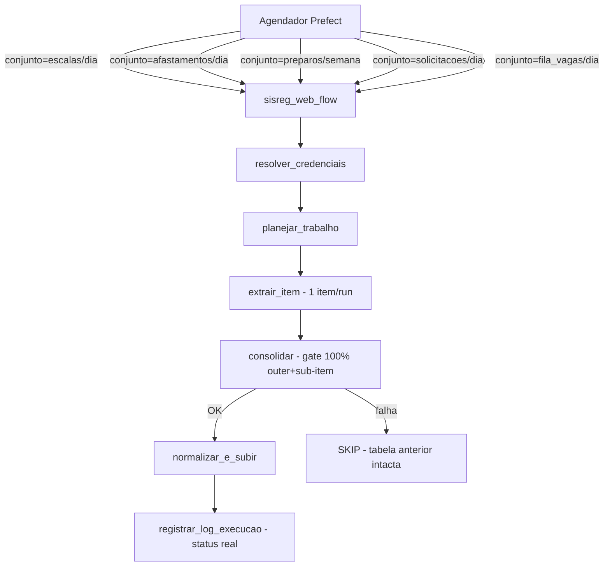
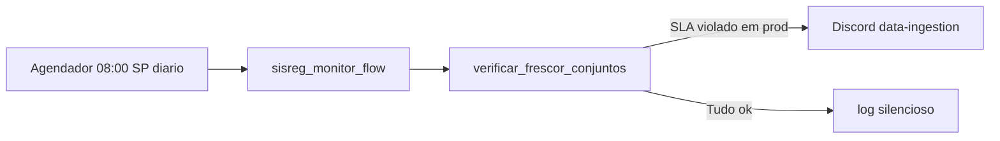
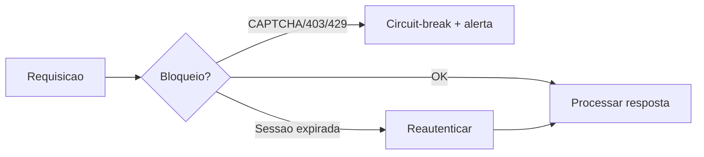

# SISREG - Extracao e Carga Unificada

Fluxo unico e parametrizado que substitui os scrapers legados do SISREG
(escalas, afastamentos, preparos, solicitacoes e fila de vagas) por um
pipeline coeso, observavel e facil de manter.

> **Dados medicos. Vidas reais.** Um erro silencioso pode levar a decisoes
> erradas de regulacao de saude. Nunca suprima erros; nunca escreva dados
> parcialmente; nunca faça bypass de CAPTCHA; sempre valide o que o SISREG
> retornou antes de gravar.

---

## Visao geral



### Monitor de frescor (fluxo proprio)



O monitor roda em fluxo **independente** do fluxo de extracao. Isso e essencial:
o monitor existe para detectar quando o fluxo de extracao **parou de rodar** -
se estivesse embutido no fluxo de extracao, nunca detectaria esse cenario.

---

## Conjuntos de dados

| Conjunto | Perfil de credencial | Tabelas de destino | Cadencia |
|---|---|---|---|
| `escalas` | `/sisreg` | `escalas` | Diaria |
| `afastamentos` | `/sisreg_regulacao` | `afastamentos`, `afastamento_historico` | Diaria |
| `preparos` | `/sisreg` | `preparos` | Semanal |
| `solicitacoes` | `/sisreg` | `solicitacoes` | Diaria |
| `fila_vagas` | `/sisreg_regulacao` | `fila_e_vagas`, `vagas_detalhadas` | Diaria |

**Dataset de destino:** `brutos_sisreg_web`

---

## Mapa de arquivos

A raiz do pacote contem apenas a superficie Prefect; toda a implementacao vive
em `nucleo/`.

```
sisreg/
  flows.py            # Flow Prefect - DAG + run config + schedule
  tasks.py            # Tasks genericas (credenciais, data, consolidacao, upload, log)
  constants.py        # URLs, cabecalhos, perfis, SLAs, janela de extracao
  schedules.py        # Um clock por conjunto (diario/semanal)
  README.md           # este arquivo
  nucleo/
    registry.py       # ConjuntoSisreg + CONJUNTOS (5 entradas, funcoes ligadas direto)
    resultado.py      # Contratos ResultadoConjunto e Consolidado (metricas reais)
    errors.py         # Taxonomia de erros (ErroAutenticacao, ErroBloqueio, etc.)
    monitor.py        # Monitor de frescor: task + fluxo + schedule proprios
    auth.py           # Login canonico, reauth inline, requisicao_com_reauth
    http.py           # requisicao_educada (jitter, retry, deteccao de bloqueio)
    parsing.py        # tabela_listagem -> DataFrame, normalizar colunas
    extractors/
      escalas.py      # GET EXPORTAR_ESCALAS -> CSV (1 item, 1 login/run)
      afastamentos.py # 1 item com todos os CPFs -> loop interno, 1 sessao
      preparos.py     # 1 item -> Unidades -> procedimentos -> textarea#preparo
      solicitacoes.py # 1 item com roteiro completo -> loop interno, 1 sessao
      fila_vagas.py   # 1 item com todos os procedimentos (BQ) -> loop interno
    tests/
      fixtures/       # HTML/CSV minimos para testes offline
      test_*.py       # stdlib unittest, sem pytest, sem chamadas reais ao SISREG
```

Dependencias entre camadas: os extratores importam apenas `constants`, `errors`,
`resultado`, `auth`, `http` e `parsing`; o `nucleo/registry.py` importa os
extratores e liga as funcoes de cada conjunto diretamente. `tasks.py` e
`flows.py` so conhecem o registry.

---

## Convencoes de codigo

- **Identificadores** (funcoes, variaveis, modulos): portugues brasileiro, **somente ASCII**
  (sem acentos em nomes de funcao/variavel). Exemplos: `abrir_sessao_autenticada`,
  `extrair_item_afastamentos`, `lista_procedimentos`.
- **Docstrings e comentarios**: portugues brasileiro natural, acentos permitidos.
- **SRP:** uma funcao, uma responsabilidade. Se precisar de "e" para descrever, divida.
- **Tipos explicitos:** toda funcao tem anotacoes de parametro e retorno.
- **Sem segredos no codigo:** credenciais somente via Infisical (`get_secret_key`).
- **Sem PII nos logs:** nunca logar CPFs em texto plano; usar indice numerico (`cpf_0`, `cpf_1`).
- **TLS sempre ligado:** `verify=True`. Nunca `verify=False` (enviamos credenciais governamentais).

---

## Fluxo de autenticacao

```mermaid
sequenceDiagram
    participant F as Flow
    participant A as auth.py
    participant S as SISREG

    F->>A: abrir_sessao_autenticada(usuario, senha)
    A->>S: GET sisregiii.saude.gov.br
    S-->>A: HTML com <form action=... campos ocultos>
    A->>S: POST {campos_ocultos, usuario, senha_256=sha256(SENHA)}
    S-->>A: HTML pos-login
    A->>A: verificar "sair" / "menu" / "bem-vindo"
    A-->>F: Session autenticada

    note over F,S: Sessao reutilizada para todos os itens (single-flight)
```



---

## Estrategia anti-ban

O SISREG detecta scrapers e pode banir o IP. A estrategia e **comportar-se como um
cliente educado e de baixo impacto**, nao contornar o bloqueio:

- **Um login por run:** cada conjunto faz UM login e reutiliza a sessao para todos os
  sub-itens (CPFs, fichas de data+status, procedimentos). Logins multiplos por run
  eram o principal risco de ban; eliminado pelo coarsening dos extratores.
- **Delay jitterizado (8.5-9.5 s):** todo request via `requisicao_educada` - nunca
  delays exatos (identificam bots), nunca `sessao.get` direto.
- **Single-flight por conta:** `num_workers=1`; nunca duas requisicoes simultaneas.
- **Reautenticacao inline:** sessao expirada mid-run (REDIRECIONAMENTO_LOGIN) dispara
  `requisicao_com_reauth` e continua o loop. Bloqueio genuino (403/429/CAPTCHA)
  aborta o run imediatamente.
- **Retreat-on-block:** CAPTCHA/403/429 acionam circuit-break imediato, nunca retry.
- **Volume minimo:** fonte de procedimentos e CPFs migrada para BigQuery (sem scraping).



---

## Modelo de escrita

- **Overwrite latest:** cada execucao bem-sucedida substitui a tabela inteira.
  Excecao: `preparos` e paginado por shard de unidades e usa **append**
  (a deduplicacao "ultima por unidade" fica na camada de modelagem).
- **Gate de completude (duplo):**
  - *Outer:* se a task de extracao retornar None, upload cancelado.
  - *Sub-item:* se qualquer CPF/ficha/procedimento for para `ids_falhos`,
    upload cancelado. A tabela anterior permanece intacta.
  - Um dia ruim se corrige na proxima execucao; o log registra o status real.
- **Janela de 180 dias:** cada execucao re-extrai os ultimos 180 dias (linhas podem
  mudar na fonte). Nunca backfill completo.
- **Particionamento:** coluna `data_extracao` computada em runtime (fuso SP).
- **Log de execucao:** `registrar_log_execucao` grava o status real (`OK`,
  `FALHA_PARCIAL`, `FALHA`) derivado do resultado efetivo da task, nunca constantes
  hardcodadas. O monitor de frescor le este log.

---

## Como adicionar um novo conjunto

1. Crie `nucleo/extractors/meu_conjunto.py` com duas funcoes puras (sem importar registry):
   - `planejar_trabalho_meu_conjunto(credenciais, params) -> dict`
   - `extrair_item_meu_conjunto(sessao, item, params) -> ResultadoConjunto | Dict[str, DataFrame]`

2. Adicione a entrada em `nucleo/registry.py`: importe o modulo no bloco de imports
   de `extractors` e inclua um `ConjuntoSisreg(...)` no dict `CONJUNTOS`, apontando
   `planejar_trabalho`/`extrair_item` para as funcoes do passo 1.

3. Adicione um clock em `schedules.py` com os `parameter_defaults` do conjunto.

4. Adicione o SLA em `constants.py:SLA_FRESCOR_DIAS`.

5. Escreva testes em `nucleo/tests/test_meu_conjunto.py` com fixture HTML/CSV.

---

## Como executar lint e testes localmente

```bash
# Lint (mirrors CI)
poetry run black . && poetry run isort . && poetry run flake8 .

# Testes offline (sem acesso ao SISREG ou BigQuery)
poetry run python -m unittest discover \
  -s pipelines/datalake/extract_load/sisreg/nucleo/tests \
  -p "test_*.py"
```

---

## Dependencias notaveis

- **Prefect 1.4.1** - fluxo, tasks, executor, storage, run config, state handlers.
- **requests** - transporte HTTP (Selenium removido).
- **beautifulsoup4 + lxml** - parsing de HTML.
- **google-cloud-bigquery** - leitura de CPFs e procedimentos do BQ curado.
- **basedosdados** - upload para o datalake (`upload_df_to_datalake`).
